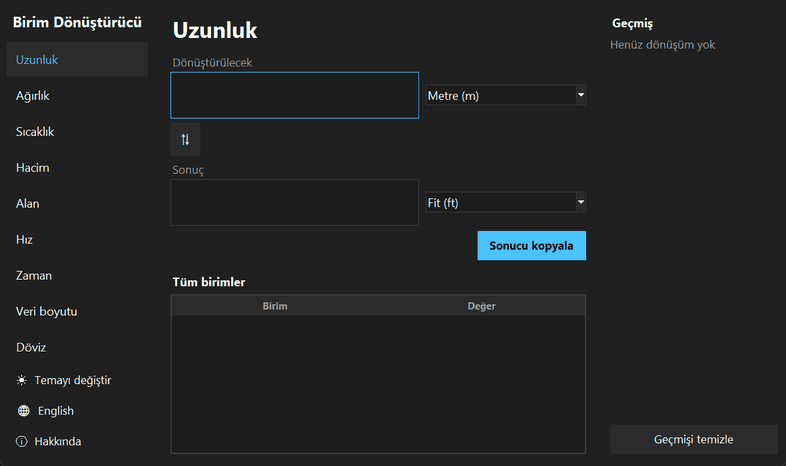
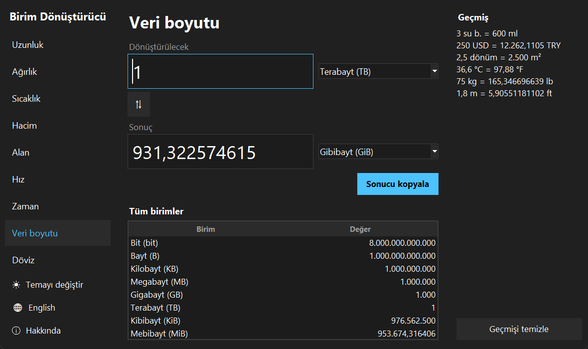
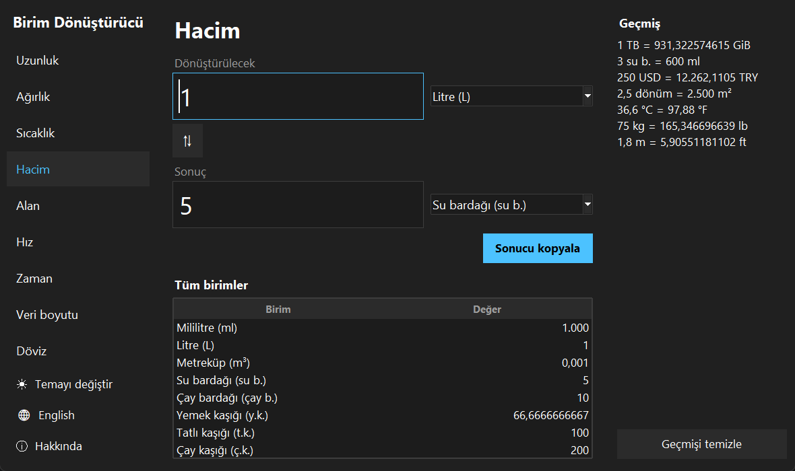
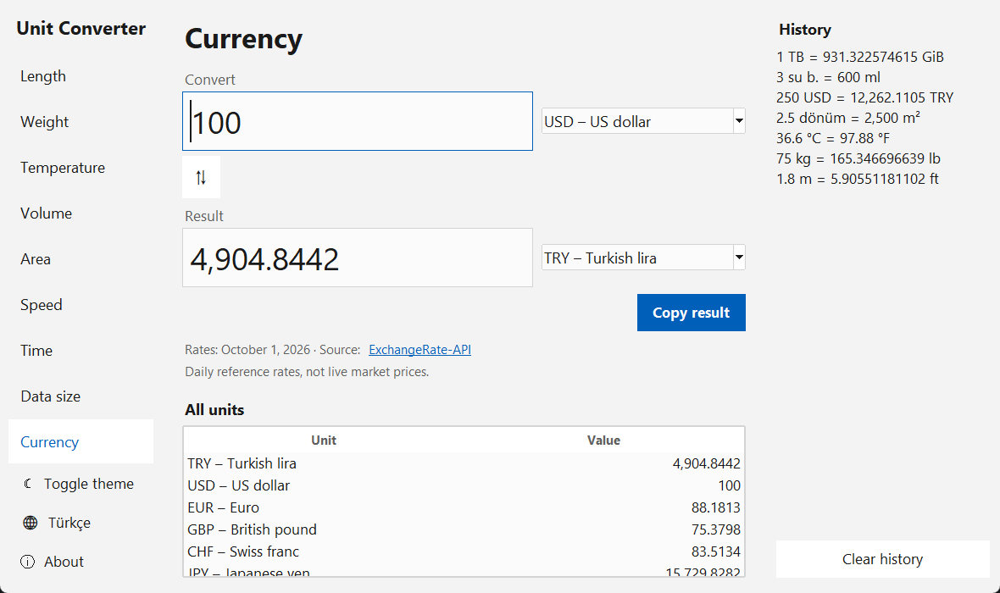

<p align="center">
  
</p>

<h1 align="center">Unit Converter</h1>

<p align="center">
  <b>English</b> | <a href="README.tr.md">Türkçe</a>
</p>

<p align="center">
  A desktop unit converter written in Python and Tkinter: nine categories, 166 currencies with daily rates,<br>
  Turkish kitchen measures and the difference between GB and GiB. Calculations are exact, using <code>Decimal</code>.
</p>

<p align="center">
  <a href="https://github.com/MrcDprm/unit-converter/releases/latest"><b>⬇️ Download for Windows</b></a>
</p>

<p align="center">
  
</p>

## Features

**Conversion**
- **Nine categories, 58 units:** length, weight, temperature, volume, area, speed, time, data size and currency
- **Live and two-way:** type in either box and the other one updates; the ⇅ button swaps the units
- **All units at a glance:** a table shows the value in every unit of the category; clicking a row copies it
- **Turkish kitchen measures:** su bardağı, çay bardağı, yemek kaşığı, tatlı kaşığı and çay kaşığı next to US cups and fluid ounces
- **GB vs GiB:** decimal and binary data units side by side, which shows why a 1 TB disk appears as 931 GB in Windows
- **Exact results:** `Decimal` arithmetic (no `0.30000000000000004`), rounding to 12 significant digits, scientific notation for very large and very small numbers
- **Input checks:** temperatures below absolute zero, invalid numbers and out-of-range values get a clear message instead of a wrong result

**Currency**
- 166 currencies from the free [ExchangeRate-API](https://www.exchangerate-api.com) (no API key needed)
- Rates are downloaded in the background, so the window never freezes
- Rates are saved with their date; without internet the app keeps working with the last rates and says how old they are
- Common currencies (TRY, USD, EUR, GBP…) come first in the list

**Interface**
- History of the last 50 conversions; clicking one brings it back
- Dark and light theme, Turkish and English interface
- Numbers are written and read in the selected language: `1.234,5` in Turkish, `1,234.5` in English
- The last category, units, theme and language are remembered

**Other**
- 38 unit tests
- Setup wizard: Start menu shortcut, uninstall support

## Screenshots

| Data size (dark, Turkish) | Volume with Turkish kitchen measures |
|---|---|
|  |  |

**Currency (light, English)**



## Installation

1. Download `UnitConverter-x.y.z-Setup.exe` from the [Releases](https://github.com/MrcDprm/unit-converter/releases/latest) page.
2. Run it and follow the setup steps. No administrator rights are needed.
3. Find the app in the Start menu as **Birim Dönüştürücü**. The interface opens in Turkish; the language button in the bottom left switches it to English.

> **Windows "protected your PC" warning:** The app is not digitally signed, so Windows SmartScreen may show a warning on first launch. Continue with **More info → Run anyway**. The full source code is open in this repository.

**Uninstall:** Settings → Apps → Installed apps → Birim Dönüştürücü → Uninstall.
History, settings and saved rates are kept in `%USERPROFILE%\.unit-converter` and are not deleted on uninstall.

## Keyboard Shortcuts

| Key | Action |
|---|---|
| `Ctrl+1` … `Ctrl+9` | Switch category |
| `Ctrl+R` | Swap units |
| `Ctrl+Shift+C` | Copy the result |
| `Enter` | Save the conversion to history now |
| `Esc` | Clear the input |
| `F5` | Load exchange rates again |

## Tech Stack

- **Python 3.12**: standard library only, no external packages
- **Tkinter / ttk**: user interface
- **decimal**: exact arithmetic
- **urllib, threading, queue**: downloading rates in the background
- **unittest**: unit tests
- **PyInstaller**: Windows `.exe` build
- **Inno Setup**: setup wizard

## Project Structure

```
unit-converter/
├── main.py         # Entry point
├── gui.py          # Tkinter interface
├── units.py        # Categories and unit tables
├── converter.py    # Number parsing and conversion
├── formatter.py    # Number formatting by language
├── currency.py     # Downloading, validating and caching exchange rates
├── history.py      # Conversion history
├── settings.py     # Language, theme and selected units
├── i18n.py         # Turkish and English texts
├── storage.py      # Saves JSON files to the user folder
├── app_info.py     # App name, version, resource paths
├── assets/         # App icon
├── docs/           # README images
├── installer/      # Inno Setup script
└── tests/          # Unit tests
```

## Running from Source

Requires Python 3.12 or newer.

```bash
python main.py           # run the app
python -m unittest -v    # run the tests
```

### Building the installer

Requires [PyInstaller](https://pyinstaller.org) and [Inno Setup 6](https://jrsoftware.org/isinfo.php).

```bash
python -m pip install pyinstaller
python -m PyInstaller --noconfirm UnitConverter.spec
ISCC installer/unit-converter.iss
```

The installer is created in the `installer/Output/` folder.

**When releasing a new version:** update the version number in both `app_info.py` (`VERSION`) and `installer/unit-converter.iss` (`AppVersion`), run the tests, run both build commands and upload the installer to a new GitHub Release.

## What I Learned

- **Floating-point numbers are not enough for unit conversion.** With `float`, `0.1 + 0.2` is not exactly `0.3`. I used `Decimal` and wrote the unit factors as text so they stay exact, then rounded only when showing the result.
- **Data structures make code shorter.** All 58 units live in one dictionary. The menu, the dropdowns and the "all units" table are generated from it, so adding a unit means adding one line.
- **Linear units and temperature are different problems.** Most units only need a factor, but temperature has an offset, so it goes through Celsius with a formula. I also had to reject values below absolute zero.
- **Numbers are written differently in each language.** In Turkish `1.000` is one thousand and `1,5` is one and a half; in English it is the other way round. I wrote my own parser and formatter for both and tested that formatted text can be read back.
- **Working with an API safely.** I downloaded rates with `urllib`, limited the response size and time, and checked every field before using it, because data from the network should not be trusted blindly. Saving the rates with their date lets the app work offline.
- **Keeping the interface responsive.** A slow download would freeze a Tkinter window, so I ran it in a background thread and passed the result back through a `queue`, because widgets may only be touched from the main thread.
- **Small details make an app feel finished.** Two-way conversion without an endless update loop, saving history only after the user stops typing (debounce), remembering the last units, and showing one clear message instead of two were most of the work.
- **Testing without side effects.** I used `unittest.mock` so the tests write to a temporary folder instead of my real settings, and replaced the network call with a fake function.
- **Distributing a desktop app.** I packaged the app with PyInstaller, built a setup wizard with Inno Setup, and kept user data in the user folder instead of the program folder.

## Future Plans

- Favourite unit pairs
- Pressure, energy and fuel economy (L/100 km ↔ mpg)
- Charts of past exchange rates
- Packages for macOS and Linux

## License

[MIT](LICENSE) © 2026 Miraç Deprem
